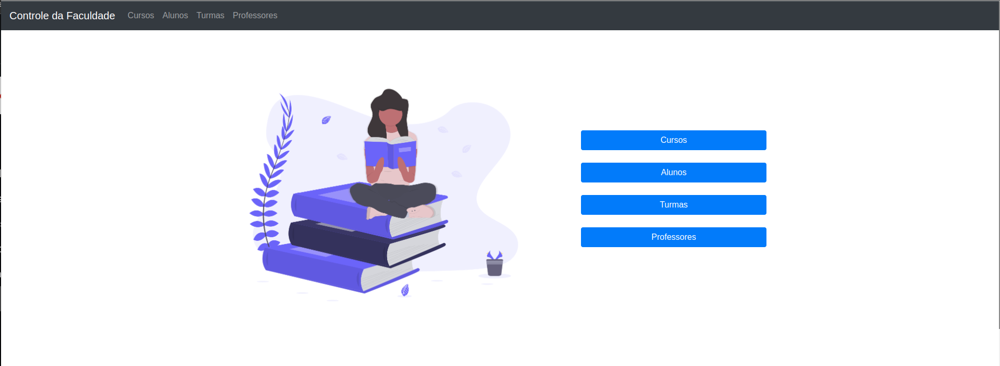

<br/>

<div align="center">
  <a href="https://www.php.net/">
    
  </a>
  <a href="https://www.mysql.com/">
    
  </a>
  <a href="https://developer.mozilla.org/pt-BR/docs/Web/HTML">
    
  </a>
</div>
<div align="center">
  <a href="https://developer.mozilla.org/pt-BR/docs/Web/CSS">
    
  </a>
  <a href="https://www.mysql.com/">
    
  </a>
  <a href="https://www.docker.com/">
    
  </a>
</div>


<br />

# 💻 Simple CRUD (PHP/MYSQL)

CRUD simples em PHP e MYSQL para controle de Turmas de Faculdade

## 🚀 Setup do Projeto

### Configuração local com docker (Recomendado)

- [Instale o Docker](https://docs.docker.com/get-docker/)
- [Instale o docker-compose](https://docs.docker.com/compose/install/)
- Abra a pasta raíz do projeto no terminal e execute o comando: 
> ```sh
> docker-compose up
> ```
- Acesso a Aplicação: http://localhost:80
- Acesso ao phpMyAdmin: http://localhost:8080
  - Usuário: root
  - Senha: root

### Configuração local sem docker

Requerimentos:
- PHP 7
- MYSQL 5
- Apache

Recomendo instalar o conjunto através de uma das ferramentas (Escolha a recomendada para o seu sistema)
[XAMPP](https://www.apachefriends.org/pt_br/index.html)
[WAMP](https://www.wampserver.com/en/)
[LAMP](https://www.digitalocean.com/community/tutorials/how-to-install-linux-apache-mysql-php-lamp-stack-on-ubuntu-20-04-pt)
[MAMP](https://www.mamp.info/en/windows/)

Independente da sua escolha você deve colocar o projeto dentro da pasta do site recomendada pela documentação de cada ferramenta
e importe através do phpmyadmin o arquivo que corresponde ao banco: `./dump/programacao_web.sql`

